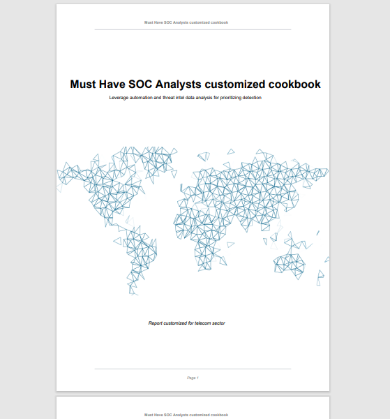
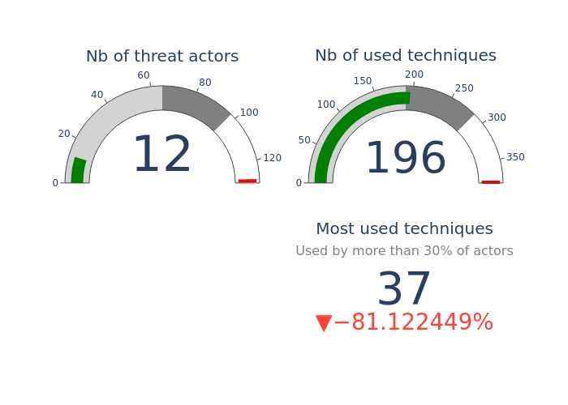

# Must have SOC analyst customized cookbook

1. Context 

Today's SOC (Security Operational Center) activity is overwhelming.  
Talented people, well defined process and governance are not anymore sufficient for keeping the adversary out of the enterprise.  
Automation is now a must have to make the job done at scale (on premise and cloud infrastructures) - actually I suggest a task than can not be automated might not anymore be done (on that manner).  
And threat intel must be used on a daily basis for short/middle term prioritization.  

2. Objectives

This project aims at helping SOC teams while providing a custom cookbook on adversaries, TTPs and statistics to maximise  detection.  
Based on MITRE ATT&CK and OSSEM datasets, the main idea is to provide a dedicated baseline to operationalize SOC efficiency from collections to remediations.  
Against a defined - and custom - sector (finance, technology, health, military, telecom, gov,...), the report production is completly automated. 
  
  

  
3. Generating the report 

The best options is to use docker.  
To generate the report, just clone the git :  
	```git clone https://github.com/tbillaut/SOC-analysts-customized-cookbook.git ```   
Generate the image :  
	```cd docker_env    
	docker build -t python/soc_cookbook:latest .  
	```  
Run it interactively :  
	```docker run -it --name MyCurrentWork --entrypoint /bin/bash -v <Your_output_destination_directory>:/usr/src/app/out python/soc_cookbook:latest```    
	```python Generate_report.py -h #for help```   
	```or python Generate_report.py -ts telecom #for telco generation report```  
	```or python Generate_report.py -ts energy #for energy generation report```  
or run it :  
	``` docker run -it --name MyCurrentWork -v <Your_output_destination_directory>:/usr/src/app/out python/soc_cookbook:latest -ts telecom
	```  

Note that all the graphs in the documents are available in a much higher definition in the output directory if you want to use it in a presentation.  
  
Examples of cookbook can be found here :  
* [Customized SOC analyst cookbook for telecom sector](https://github.com/tbillaut/SOC-analyst-customized-cookbook/blob/main/examples/SOC_cookbook_for_telecom.pdf)  
* [Customized SOC analyst cookbook for defense sector](https://github.com/tbillaut/SOC-analyst-customized-cookbook/blob/main/examples/SOC_cookbook_for_defense.pdf)  
* [Customized SOC analyst cookbook for energy sector](https://github.com/tbillaut/SOC-analyst-customized-cookbook/blob/main/examples/SOC_cookbook_for_energy.pdf)
* [Customized SOC analyst cookbook for health sector](https://github.com/tbillaut/SOC-analyst-customized-cookbook/blob/main/examples/SOC_cookbook_for_health.pdf)  
* [Customized SOC analyst cookbook for manufacturing sector](https://github.com/tbillaut/SOC-analyst-customized-cookbook/blob/main/examples/SOC_cookbook_for_manufacturing.pdf)
* etc...  
  
Reports can sometimes be boring to read. A quick presentation made upon the cookbook materials can be an idea to circumvent this. An exemple can be found here :  
* [Customized SOC analyst cookbook for manufacturing sector](https://github.com/tbillaut/SOC-analyst-customized-cookbook/blob/main/examples/Presentation_SOC_cookbook_for_manufacturing.pdf)  
  
  
  
  
4. next steps

This is the first step, not the last (many improvements on content and form are required).  
However, good enough for now.  
May this work be of help for you.  
Improvement and suggestions are welcome. 


5. collaborate 

I'll do my best to review proposed changes - and to commit.  
https://docs.github.com/en/pull-requests/collaborating-with-pull-requests  

6. Contact 

Feel free to contact me:  
Thomas Billaut / <thomas.billaut@protonmail.com>  
  
See you soon :)  